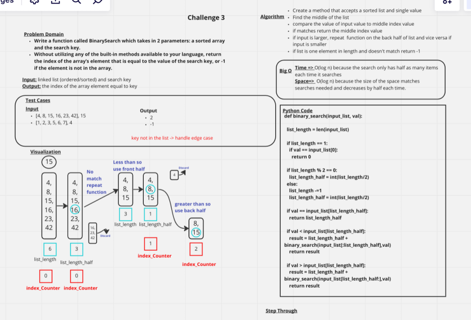

# Binary Search of Sorted Array
Write a function called BinarySearch which takes in 2 parameters: a sorted array and the search key. Without utilizing any of the built-in methods available to your language, return the index of the array’s element that is equal to the value of the search key, or -1 if the element is not in the array.

## Whiteboard Process

 

## Approach & Efficiency

Time => O(log n) because the search only has half as many items each time it searches
Space=>  O(log n) because the size of the space matches searches needed and decreases by half each time.
