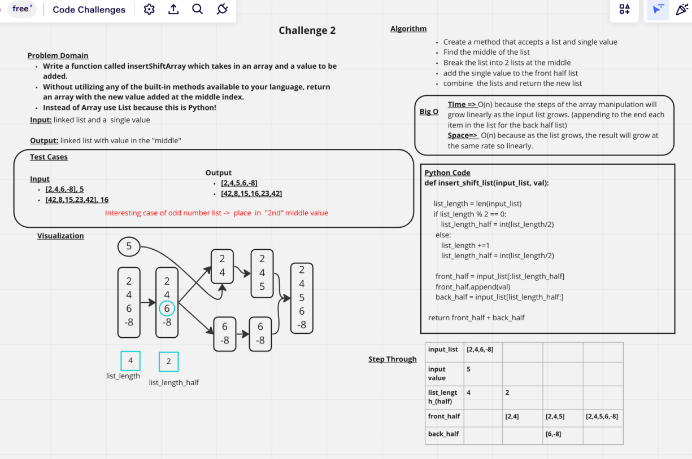

# Insert to Middle of an Array
+ Write a function called insertShiftArray which takes in an array and a value to be added. Without utilizing any of the built-in methods available to your language, return an array with the new value added at the middle index.

## Whiteboard Process

## Approach & Efficiency
Time => O(n) because the steps of the array manipulation will grow linearly as the input list grows. (appending to the end each item in the list for the back half list)
Space=>  O(n) because as the list grows, the result will grow at the same rate so linearly.
