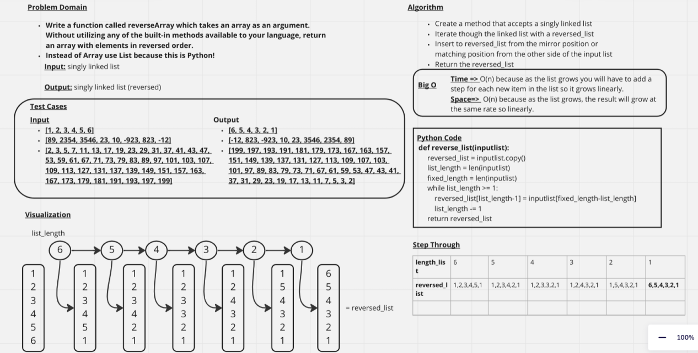

# Reverse an Array

+ Write a function called reverseArray which takes an array as an argument.
+ Without utilizing any of the built-in methods available to your language, return an array with elements in reversed order.
+ Instead of Array use List because this is Python!

## Whiteboard Process
 

## Approach & Efficiency
Not being able to use the build in functions I found a way to iterate through the list with while loop and the length of the input list. As I iterated through the list I would add the item in the input list to the reverse list from the opposite side to cause the list to be reversed.

Time => O(n) because as the list grows you will have to add a
step for each new item in the list so it grows linearly.
Space=>  O(n) because as the list grows, the result will grow at the same rate so linearly.
