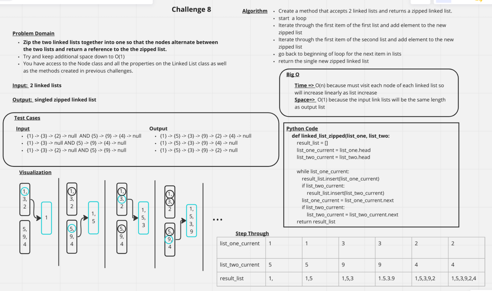

# Challenge Summary
Zip the two linked lists together into one so that the nodes alternate between the two lists and return a reference to the the zipped list.

## Whiteboard Process

## Approach & Efficiency
Time => O(n) because must visit each node of each linked list so will increase linearly as list increase
Space=>  O(1) because the input link lists will be the same length as output list

## Solution
[Link to Code for Link List Zip](../../code_challenges/linked_list_zip.py)
