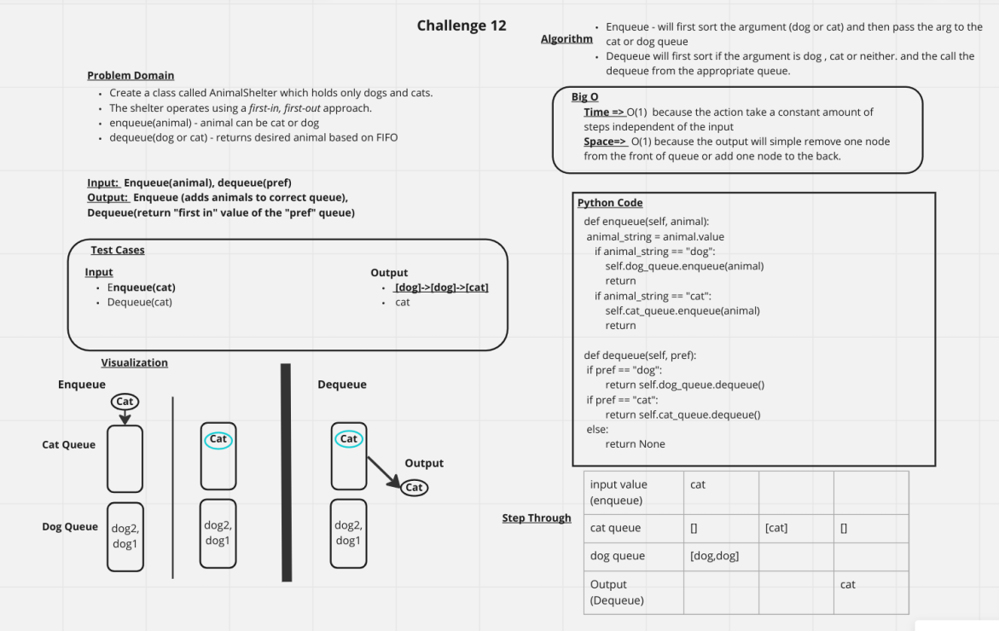

# Challenge Summary
Create a class called AnimalShelter which holds only dogs and cats.
The shelter operates using a first-in, first-out approach.
enqueue(animal) - animal can be cat or dog
dequeue(dog or cat) - returns desired animal based on FIFO

## Whiteboard Process

## Approach & Efficiency
Time => O(1)  because the action take a constant amount of steps independent of the input
Space=>  O(1) because the output will simple remove one node from the front of queue or add one node to the back.

## Solution
[Solution Link](../../code_challenges/stack_queue_animal_shelter.py)
