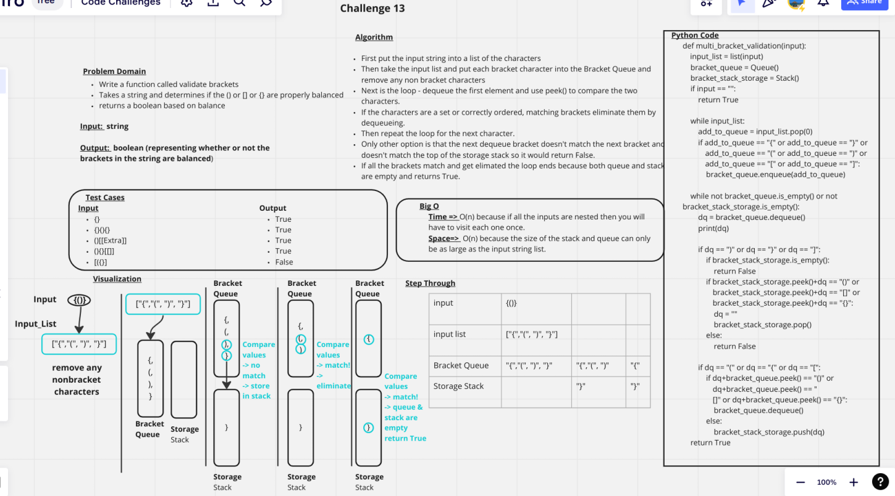

# Challenge Summary
Write a function called validate brackets
Takes a string and determines if the () or [] or {} are properly balanced
returns a boolean based on balance

## Whiteboard Process

## Approach & Efficiency
Time => O(n) because if all the inputs are nested then you will have to visit each one once.
Space=>  O(n) because the size of the stack and queue can only be as large as the input string list.

## Solution
[Code for Challenge](../../code_challenges/stack_queue_brackets.py)
