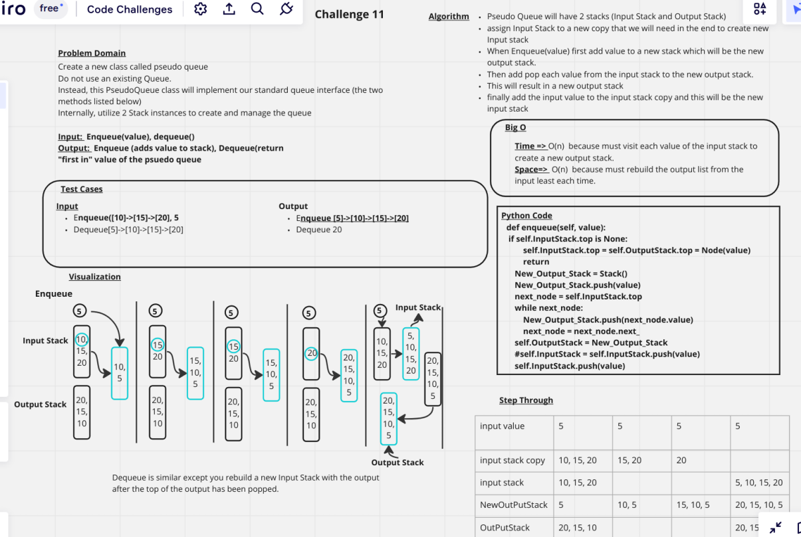

# Challenge Summary

+ Create a new class called pseudo queue
+ Do not use an existing Queue.
+ Instead, this PseudoQueue class will implement our standard queue interface (the two methods listed below)
+ Internally, utilize 2 Stack instances to create and manage the queue

## Whiteboard Process

## Approach & Efficiency
+ Time => O(n)  because must visit each value of the input stack to create a new output stack.
+ Space=>  O(n)  because must rebuild the output list from the input least each time.

## Solution
+ [Link to the Stack Queue Pseudo code](../../code_challenges/stack_queue_pseudo.py)

