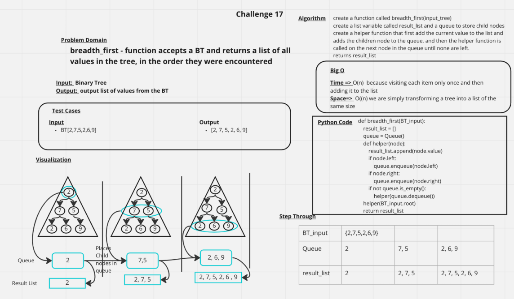

# Challenge Summary
breadth_first - function accepts a BT and returns a list of all values in the tree, in the order they were encountered

## Whiteboard Process

## Approach & Efficiency
Time => O(n)  because visiting each item only once and then adding it to the list
Space=>  O((n) we are simply transforming a tree into a list of the same size

## Solution
[Link to Code](../../code_challenges/tree_breadth_first.py)
