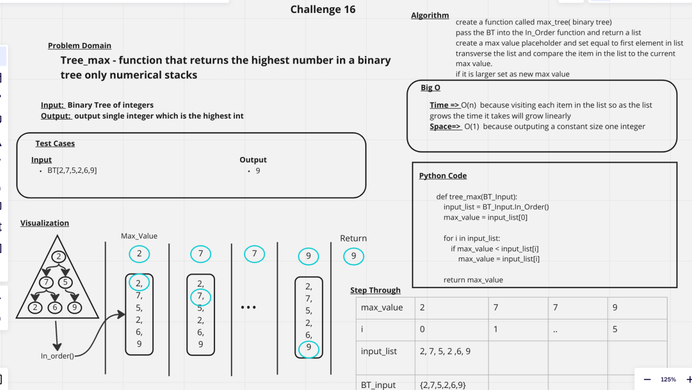

# Challenge Summary
Find the Maximum Value in a Binary Tree

## Whiteboard Process

## Approach & Efficiency
Time => O(n^2)  because visiting each item recursively with in_order and in the list so it takes will grow quadratically
Space=>  O(1)  because outputing a constant size one integer

## Solution

